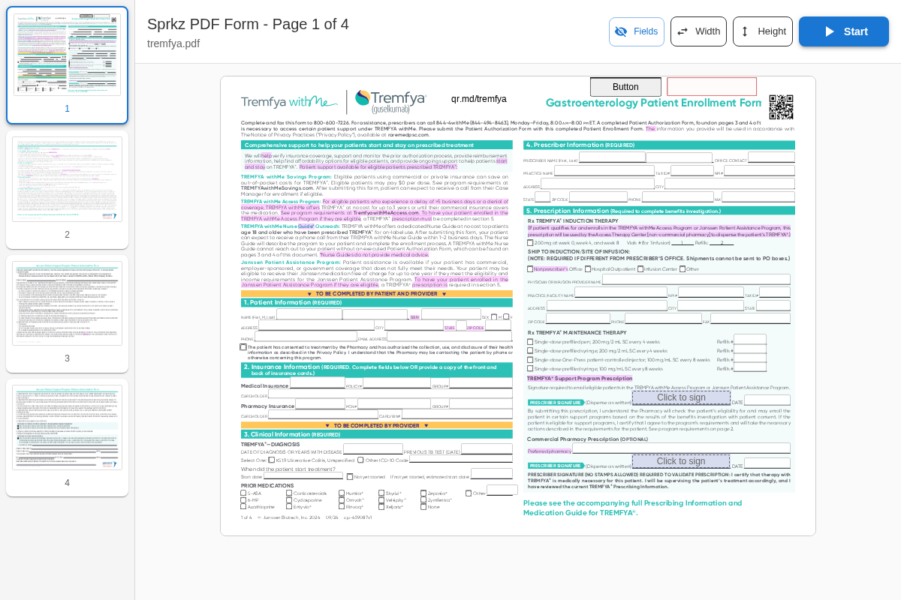

# Documentation Directory

This directory contains the active documentation for the Sprkz PDF form completion platform.

## Current Documentation

### GETTING_STARTED.md
**Claude Code implementation prompt** - Comprehensive first-step guide and prompt for Claude Code to begin implementation of the Sprkz platform.

**Use for:**
- Starting implementation with Claude Code
- Project setup and initialization instructions
- Validation checkpoints and success criteria
- TDD workflow establishment
- Essential documentation reading order

### IMPLEMENTATION_PLAN.md
**Primary implementation guide** - Comprehensive 11-phase step-by-step implementation plan that resolves all architectural inconsistencies and provides unified requirements.

**Use for:**
- Development roadmap and timeline
- Technology stack decisions
- Architecture guidance
- Phase-by-phase implementation steps
- Quality gates and success metrics

### CLAUDE.md
**Claude Code guidance** - Instructions for AI-assisted development with this codebase.

**Use for:**
- Understanding project structure and patterns
- Development commands and workflows
- Architecture decisions and constraints
- Technology stack information

### PRD.md
**Product Requirements Document** - Business requirements, user stories, and feature specifications.

**Use for:**
- Understanding business objectives
- Feature requirements and acceptance criteria
- User experience specifications
- Success metrics and KPIs

### WIZARD_FEATURE.md
**Wizard Feature Specification** - Detailed specification for the guided form completion wizard.

**Use for:**
- Wizard navigation behavior
- User interaction patterns
- State management requirements
- UI/UX implementation details

### TDD_GUIDELINES.md
**Test-Driven Development Guidelines** - Comprehensive guide for implementing TDD throughout the project.

**Use for:**
- TDD methodology and best practices
- Testing stack and configuration
- Test organization and naming conventions
- Coverage requirements and quality gates

### FEATURE_FLAGS.md
**Feature flags strategy and implementation** - Comprehensive guide for using Unleash feature flags throughout the application.

**Use for:**
- Feature flag configuration and setup
- Strategic flag implementation patterns
- Testing strategies for flag-dependent features
- Rollout and lifecycle management

### ERROR_MONITORING.md
**Error monitoring and tracking strategy** - Comprehensive guide for Sentry integration and error handling throughout the application.

**Use for:**
- Sentry configuration and setup
- PDF-specific error tracking patterns
- Performance monitoring implementation
- Production monitoring and alerting

### CODE_QUALITY.md
**Code quality standards and automation** - Comprehensive guide for maintaining professional code quality with automated tools and workflows.

**Use for:**
- ESLint and Prettier configuration
- Husky and lint-staged setup for Git hooks
- Pre-commit automation and quality enforcement
- TypeScript strict mode configuration
- Development workflow best practices

## Documentation Hierarchy

### For Implementation (Start Here)
1. **GETTING_STARTED.md** - First step prompt for Claude Code implementation
2. **IMPLEMENTATION_PLAN.md** - Master plan (supersedes all others for technical decisions)
3. **TDD_GUIDELINES.md** - Required development methodology
4. **CODE_QUALITY.md** - Code quality standards and automation tools
5. **FEATURE_FLAGS.md** - Feature flags strategy and implementation
6. **ERROR_MONITORING.md** - Error monitoring and tracking with Sentry

### For Understanding Requirements
6. **PRD.md** - Business requirements baseline
7. **WIZARD_FEATURE.md** - Detailed feature specification

### For Reference
8. **CLAUDE.md** - Development guidance and project context

## Archive

Historical documentation that has been superseded is located in the `../archive/` directory. See `../archive/README.md` for details on archived files.

## Screenshots

### Application Interface Screenshots

The Sprkz application has several key interfaces accessible through different routes:

#### Main Application Routes

**Home Page (`/`)**

- Default landing page with PDF loading interface
- Redirects to configured PDF routes or file selection

**Makana Form (`/makana`)**

- Fully configured PDF form with all features enabled
- Uses `makana2025.pdf` with custom field configurations
- Includes wizard navigation, form validation, and signature capabilities

**Tremfya Form (`/tremfya`)**

- Complete PDF form interface for Tremfya pharmaceutical form
- All features enabled with standard field configurations
- Demonstrates dynamic routing capabilities

**Test Route (`/test`)**

- Minimal feature configuration for testing purposes
- Only Fields Toggle Button and PDF Fit Height Button enabled
- Uses `makana2025.pdf` with basic functionality

#### Admin Interface

**Admin Dashboard (`/admin`)**

- Configuration interface for managing URL routes, PDF files, and feature flags
- Database-driven configuration system
- Real-time feature toggle management

### Database-Configured Routes

The application uses a dynamic routing system where each URL path can be configured with:
- **Custom PDF files** - Different PDFs for different routes
- **Feature toggles** - Enable/disable specific UI components
- **Field configurations** - Customize form field behavior (hidden, read-only, etc.)

See the admin interface to manage these configurations dynamically.

## Usage Notes

### For Claude Code Implementation
- **Start with `GETTING_STARTED.md`** - This is your implementation entry point and contains the complete first-step prompt
- Always refer to `IMPLEMENTATION_PLAN.md` for architectural and technical decisions
- Follow `TDD_GUIDELINES.md` strictly - TDD is mandatory for this project

### For Understanding the Project
- Use `PRD.md` for understanding business requirements and user needs
- Reference `WIZARD_FEATURE.md` for specific wizard implementation details
- Follow `CLAUDE.md` for AI-assisted development best practices and project context